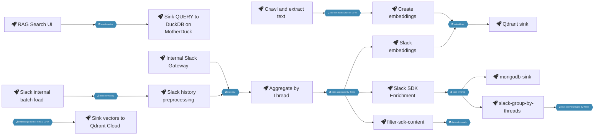

```mermaid
%%{ init: { 'flowchart': { 'curve': 'monotoneX' } } }%%
graph LR;
RAG_Search_UI[fa:fa-rocket RAG Search UI &#8205] --> searchqueries{{ fa:fa-arrow-right-arrow-left searchqueries &#8205}}:::topic;
searchqueries{{ fa:fa-arrow-right-arrow-left searchqueries &#8205}}:::topic --> Sink_QUERY_to_DuckDB_on_MotherDuck[fa:fa-rocket Sink QUERY to DuckDB on MotherDuck &#8205];
Crawl_and_extract_text[fa:fa-rocket Crawl and extract text &#8205] --> raw-text-chunks-2024-04-05-v2{{ fa:fa-arrow-right-arrow-left raw-text-chunks-2024-04-05-v2 &#8205}}:::topic;
raw-text-chunks-2024-04-05-v2{{ fa:fa-arrow-right-arrow-left raw-text-chunks-2024-04-05-v2 &#8205}}:::topic --> Create_embeddings[fa:fa-rocket Create embeddings &#8205];
Create_embeddings[fa:fa-rocket Create embeddings &#8205] --> embeddings{{ fa:fa-arrow-right-arrow-left embeddings &#8205}}:::topic;
Internal_Slack_Gateway[fa:fa-rocket Internal Slack Gateway &#8205] --> slack-raw{{ fa:fa-arrow-right-arrow-left slack-raw &#8205}}:::topic;
slack-raw{{ fa:fa-arrow-right-arrow-left slack-raw &#8205}}:::topic --> Aggregate_by_Thread[fa:fa-rocket Aggregate by Thread &#8205];
Aggregate_by_Thread[fa:fa-rocket Aggregate by Thread &#8205] --> slack-aggregated-by-thread{{ fa:fa-arrow-right-arrow-left slack-aggregated-by-thread &#8205}}:::topic;
slack-aggregated-by-thread{{ fa:fa-arrow-right-arrow-left slack-aggregated-by-thread &#8205}}:::topic --> Slack_SDK_Enrichment[fa:fa-rocket Slack SDK Enrichment &#8205];
Slack_SDK_Enrichment[fa:fa-rocket Slack SDK Enrichment &#8205] --> slack-enriched{{ fa:fa-arrow-right-arrow-left slack-enriched &#8205}}:::topic;
Slack_internal_batch_load[fa:fa-rocket Slack internal batch load &#8205] --> slack-raw-history{{ fa:fa-arrow-right-arrow-left slack-raw-history &#8205}}:::topic;
slack-raw-history{{ fa:fa-arrow-right-arrow-left slack-raw-history &#8205}}:::topic --> Slack_history_preprocessing[fa:fa-rocket Slack history preprocessing &#8205];
Slack_history_preprocessing[fa:fa-rocket Slack history preprocessing &#8205] --> slack-raw{{ fa:fa-arrow-right-arrow-left slack-raw &#8205}}:::topic;
slack-aggregated-by-thread{{ fa:fa-arrow-right-arrow-left slack-aggregated-by-thread &#8205}}:::topic --> Slack_embeddings[fa:fa-rocket Slack embeddings &#8205];
Slack_embeddings[fa:fa-rocket Slack embeddings &#8205] --> embeddings{{ fa:fa-arrow-right-arrow-left embeddings &#8205}}:::topic;
embeddings{{ fa:fa-arrow-right-arrow-left embeddings &#8205}}:::topic --> Qdrant_sink[fa:fa-rocket Qdrant sink &#8205];
slack-aggregated-by-thread{{ fa:fa-arrow-right-arrow-left slack-aggregated-by-thread &#8205}}:::topic --> filter-sdk-content[fa:fa-rocket filter-sdk-content &#8205];
filter-sdk-content[fa:fa-rocket filter-sdk-content &#8205] --> slack-sdk-threads{{ fa:fa-arrow-right-arrow-left slack-sdk-threads &#8205}}:::topic;
embeddings-sbert-all-MiniLM-L6-v2{{ fa:fa-arrow-right-arrow-left embeddings-sbert-all-MiniLM-L6-v2 &#8205}}:::topic --> Sink_vectors_to_Qdrant_Cloud[fa:fa-rocket Sink vectors to Qdrant Cloud &#8205];
slack-enriched{{ fa:fa-arrow-right-arrow-left slack-enriched &#8205}}:::topic --> mongodb-sink[fa:fa-rocket mongodb-sink &#8205];
slack-enriched{{ fa:fa-arrow-right-arrow-left slack-enriched &#8205}}:::topic --> slack-group-by-threads[fa:fa-rocket slack-group-by-threads &#8205];
slack-group-by-threads[fa:fa-rocket slack-group-by-threads &#8205] --> slack-internal-grouped-by-thread{{ fa:fa-arrow-right-arrow-left slack-internal-grouped-by-thread &#8205}}:::topic;


classDef default font-size:110%;
classDef topic font-size:80%;
classDef topic fill:#3E89B3;
classDef topic stroke:#3E89B3;
classDef topic color:white;
```